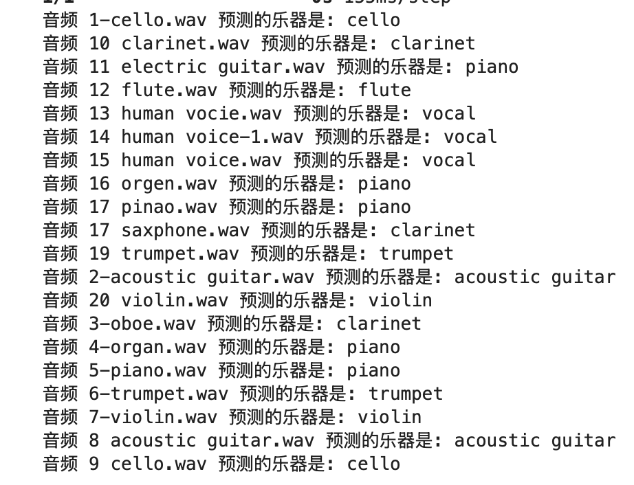

# Deep Learning for Noisy Musical Instrument Classification  
**DL4M Final Project – Group 8**

---

## Project Idea and Goals  
The goal of this project is to build a **robust musical instrument classification system** that performs well under noisy audio conditions.  
While many models achieve high accuracy on clean datasets, their performance often drops sharply in real-world environments with background noise.  
We address this gap by using **YAMNet** embeddings as input to a **Temporal Convolutional Network (TCN)**, and apply **curriculum learning** to fine-tune the model progressively on increasingly noisy data.

---

## Data Description  

To construct a realistic and effective dataset for noisy musical instrument classification,  
we adopted a data augmentation strategy by combining two well-established datasets:

- **IRMAS** (Instrument Recognition in Musical Audio):  
  Designed for automatic recognition of predominant musical instruments.  
  It provides a diverse collection of isolated instrument recordings, closely aligned with the goal of our project.

- **MUSAN**:  
  A dataset created for music/speech/noise classification tasks.  
  We specifically used the noise subset of MUSAN to simulate realistic background conditions.

## Dataset Creation Workflow

1. Load Data
Use pathlib() to access the IRMAS instrument audio files.
Filter out unnecessary system files (e.g., ._ hidden files).


2. Select and Process Noise
Randomly select a noise file from the MUSAN noise subset.
Scale it to a target SNR (Signal-to-Noise Ratio) to simulate different noise levels.


3. Mix and Generate
Combine each clean instrument audio with the scaled noise to generate a noisy sample.
Repeat this process across various SNR levels.


4. Save Output
Save the mixed audio into separate folders based on the SNR level.
We created four versions of the dataset corresponding to different noise intensities:
	•	SNR10 (clean)
	•	SNR5
	•	SNR0
	•	SNR-5 (most noisy)


📌 Note: All audio files were resampled to 16kHz to match the input requirement of YAMNet and to ensure training efficiency.

---

## Code Structure and Organization  
```
├── embeddings/              # Saved YAMNet features and labels (.npy files)
├── checkpoints/             # Trained model weights (h5 files)
├── train.ipynb               # Full training + curriculum pipeline (notebook)
├── utils.py                 # Feature extraction, label mapping, data helpers
├── models.py                # Model architecture definition (TCN)
├── dataset_processing.ipynb
├── run_test.ipynb              # Real-world prediction on YouTube clips
├── README.md
```

- **Notebook** (`train.ipynb `) includes:
  - Baseline model training on clean data
  - Progressive fine-tuning on noisy subsets (SNR5 → SNR0 → SNR–5)
  - Evaluation results and test prediction

- **Notebook** (`dataset_processing.ipynb `) includes:
  - Dataset creation workflow combining IRMAS and MUSAN
  - Noise scaling and mixing at multiple SNR levels: SNR10 (clean), SNR5, SNR0, SNR–5
  - Automatic resampling and file output for training

- **Notebook** (`run_test.ipynb `) includes:
  - Test notebook for real-world audio classification using the trained model.
  - Loads WAV files, extracts YAMNet embeddings, formats them, and outputs predicted instrument labels.


---

## Results and Key Findings  

To evaluate the performance of our trained TCN-based instrument classification model, we tested it on a set of 20 audio samples, each representing a different musical instrument or vocal sound.

Each audio file was:
	•	Resampled to 16 kHz
	•	Passed through the YAMNet model to extract high-level embeddings (T × 1024)
	•	Truncated or zero-padded to a uniform length of 60 frames, resulting in an input shape of (20, 60, 1024) for the classifier



### Prediction Results Table (22 YouTube Samples)

| Audio file            | Prediction Label | Correct |
|-----------------------|------------------|---------|
| 1-cello.wav           | cello            | ✅      |
| 10-clarinet.wav       | clarinet         | ✅      |
| 11-electric guitar.wav| piano            | ❌      |
| 12-flute.wav          | flute            | ✅      |
| 13-human voice.wav    | vocal            | ✅      |
| 14-human voice-1.wav  | vocal            | ✅      |
| 15-human voice.wav    | vocal            | ✅      |
| 16-organ.wav          | piano            | ❌      |
| 17-piano.wav          | piano            | ✅      |
| 18-saxphone.wav       | clarinet         | ❌      |
| 19-trumpet.wav        | trumpet          | ✅      |
| 2-acoustic guitar.wav | acoustic guitar  | ✅      |
| 20-violin.wav         | violin           | ✅      |
| 3-oboe.wav            | clarinet         | ❌      |
| 4-organ.wav           | piano            | ❌      |
| 5-piano.wav           | piano            | ✅      |
| 6-trumpet.wav         | trumpet          | ✅      |
| 7-violin.wav          | violin           | ✅      |
| 8-acoustic guitar.wav | acoustic guitar  | ✅      |
| 9-cello.wav           | cello            | ✅      |

### Test Accuracy  
- **Correct Predictions**: 15 out of 20  
- **Overall Accuracy**: 75%

---

### Misclassification Analysis  

The model performed well overall but showed confusions in the following categories:

- **Organ → Piano**: Instruments have overlapping harmonic and timbral features in the embedding space.  
- **Saxophone → Clarinet**: A common error due to similar spectral content and pitch range.  
- **Oboe confusion**: Possibly due to limited data for oboe-like timbres.

---

### Insights  

- YAMNet embeddings enhanced generalization due to large-scale pretraining.  
- Most errors involved timbrally similar instruments, showing the model learned coarse distinctions but struggled with fine-grained nuance.

---

### Takeaways  

Combining pretrained embeddings and TCN leads to strong results on noisy instrument recognition.


**Key insight**: Curriculum learning greatly improves generalization under increasing noise levels, especially on real-world data.

---

## Group Member Contributions  

- **Zixuan Guo**  
  Project coordination, model exploration, model architecture (TCN), curriculum learning pipeline, code structuring, and writing README sections 1, 3, and 5.

- **Yuantao Li**  
  Responsible for searching, testing, and creating the datasets of this project. Contributed to README sections 2.

- **Mier Huang**  
  Real-world testing, data analysis and writing README section 4 (Results and Key Findings).

---

For full training and testing code, see: `train.ipynb`  
For real-world demo: run `run_test.ipynb` with your own audio
